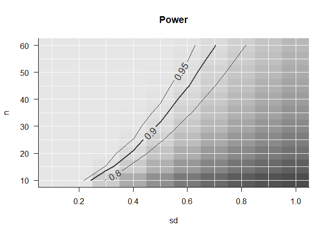

<!-- README.md is generated from README.Rmd. Please edit that file -->

# powergrid

Powergrid is a package developed by [Gilles
Dutilh](https://www.gillesdutilh.com), partly funded by a [Statistical
programming
grant](https://www.sctoplatforms.ch/en/scto-platforms/statistics-methodology-5.html)
from the SCTO.

The powergrid package is intended to allow users to easily evaluate a function
across a grid of input parameters. The utilities in the package are aimed at performing
analyses of *power and sample size*, allowing for easy search of minimum n (or
min/max of any other parameter) to achieve a desired level of power (or any
other objective). Also, plotting functions are included that present the
dependency of n and power in relation to further parameters.

Note that the package is currently in (a late stage of) development.
Development may be followed at [Gilles’
github](https://www.github.com/gillesdutilh/powergrid). You are
encouraged to use the package released here on SCTO’s github, currently
version v0.1.0. For replicability, make sure you explicitly refer to the
current release when loading the package in your code:

``` r
devtools::install_github("SwissClinicalTrialOrganisation/powergrid",
                         build_vignette = TRUE)
library(powergrid)
```

## Example usage

Define a grid of parameters to evaluate a function across:

``` r
sse_pars <- list( # a simple list
  n = seq(from = 10, to = 60, by = 5), # sample size
  sd = seq(from = 0.1, to = 1, by = 0.1) # standard deviation
)
```

Define a function to evaluate the parameters across the grid. The
function should take the parameters as input and return a single value
(e.g., power, sample size, etc.). For example, we can use the
`power.t.test` function from the `stats` package to calculate power for
a t-test:

``` r
PowFun <- function(n, sd){
  ptt = power.t.test(n = n/2,
                     delta = .6,
                     sd = sd,
                     sig.level = 0.05)
  return(ptt$power)
}
```

Evaluate the function at each grid node:

``` r
power <- PowerGrid(pars = sse_pars, fun = PowFun)
```

Display the results:

``` r
PowerPlot(power)
```

<!-- -->

See the vignette for more details on how to use the package and its
functions.

Please don’t hesitate making an issue above or contributing through a
pull request. You may also contact Gilles by
[email](mailto:info@gillesdutilh.com).
